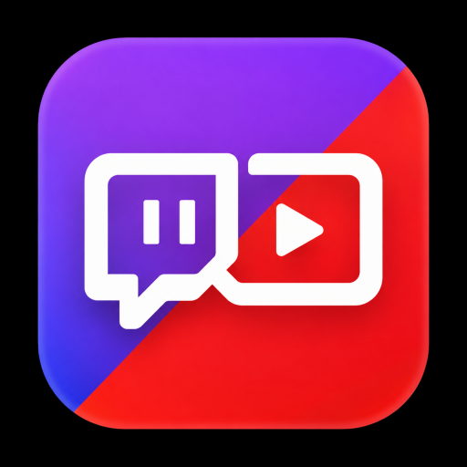
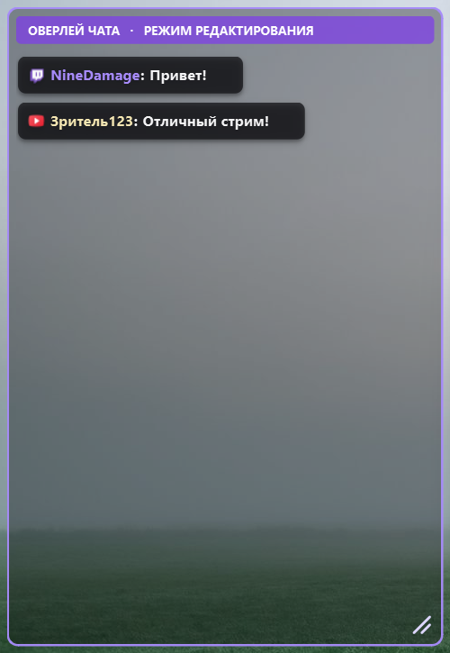
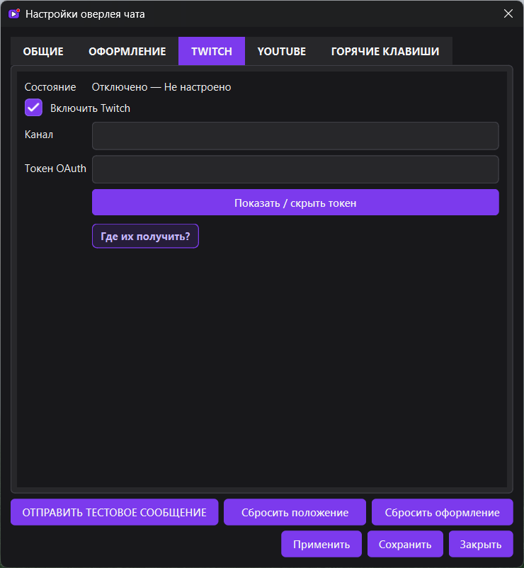
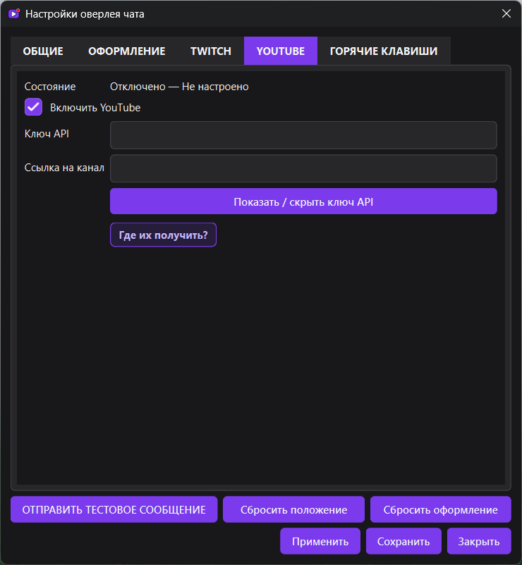
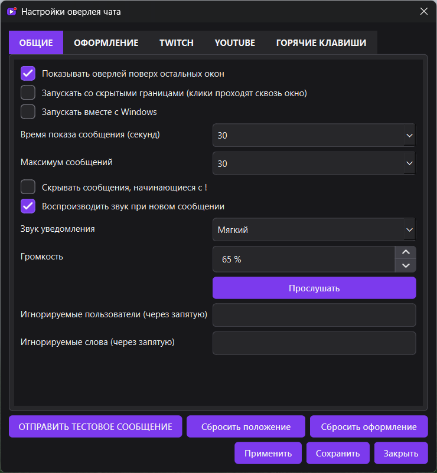
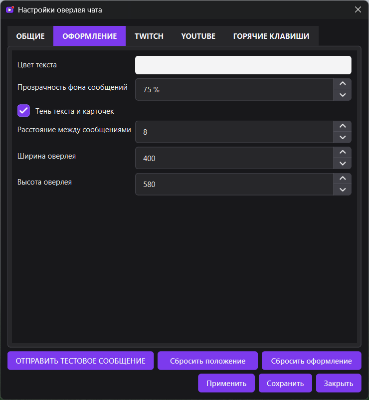
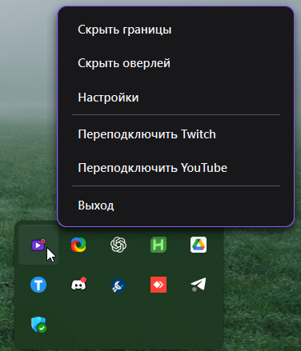

# Twitch + YouTube Chat Overlay

<p align="center">
  
</p>

Нативный оверлей чатов Twitch и YouTube для 64-битной Windows 10/11. Приложение объединяет сообщения обеих платформ в одном прозрачном окне поверх оконных и borderless-игр.

Оверлей является обычным окном Windows: он не внедряется в процесс игры, не устанавливает хуки и не читает память других приложений.

## Скачать

Готовая сборка находится на странице [последнего релиза](https://github.com/9damage/Twitch-YouTube-Chat-Overlay/releases/latest):

1. скачайте `TwitchYouTubeChatOverlay.exe`;
2. запустите файл — установка и `.env` не требуются;
3. заполните данные нужных платформ в настройках;
4. нажмите «Сохранить».

Windows SmartScreen может предупредить о новом неподписанном приложении. Это ожидаемо для самостоятельной PyInstaller-сборки без платного сертификата подписи. Исходный код и инструкция воспроизводимой сборки находятся в этом репозитории.

## Возможности

- единая лента Twitch IRC и YouTube Live Chat;
- вывод значка платформы, цветного имени автора и сообщения в одной строке;
- цвет Twitch-ника из данных платформы и единый мягкий цвет YouTube-ников;
- перенос длинных сообщений без обрезания и удаление карточек, которые уже не помещаются в оверлей;
- порядок сообщений сверху вниз: старые сверху, новые снизу;
- прозрачность карточек, цвет текста, тень и расстояние между сообщениями;
- фиксированный жирный шрифт Segoe UI размером 10;
- режим редактирования с заметной рамкой и маркером изменения размера;
- режим со скрытыми границами и настоящим Windows click-through;
- Always On Top, сохранение положения и размера оверлея;
- собственное меню приложения и меню в области уведомлений;
- глобальные горячие клавиши;
- автозапуск вместе с Windows и необязательный запуск свёрнутым в трей;
- автоматическое переподключение с увеличивающейся задержкой;
- три звука уведомлений, регулировка громкости и полное отключение звука;
- время показа, лимит сообщений, фильтр команд, пользователей и слов;
- тестовые сообщения без подключения Twitch или YouTube;
- отображение Bits, Super Chat и ролей пользователей;
- журналирование с ротацией без записи токенов и API-ключей.

### Компактный оверлей поверх игры

Сообщения Twitch и YouTube собраны в одной ленте, а фон, рамка и размер окна настраиваются под игру. В режиме редактирования оверлей легко перемещать и растягивать; после скрытия границ он перестаёт перехватывать клики.

<p align="center">
  
</p>

## Быстрый старт

После первого запуска открывается окно настроек. Приложение можно использовать в тестовом режиме, даже если ни одна платформа ещё не настроена.

Кнопка «ОТПРАВИТЬ ТЕСТОВОЕ СООБЩЕНИЕ» проверяет отображение Twitch/YouTube-карточек и выбранный звук уведомления.

### Twitch

Для чтения Twitch-чата нужны два значения:

1. **Канал** — имя после `twitch.tv/`. Для `twitch.tv/twitchdev` укажите `twitchdev`.
2. **Токен OAuth** — пользовательский Twitch-токен с разрешением `chat:read`. Префикс `oauth:` вводить необязательно.

Имя пользователя, которому принадлежит токен, вводить не нужно: приложение определяет и проверяет его автоматически. Затем клиент подключается к Twitch IRC через TLS, запрашивает IRC tags/commands/membership, отвечает на PING и переподключается при потере соединения.

### YouTube

Для чтения публичного YouTube-чата нужны:

1. **Ключ API** проекта Google Cloud с включённым YouTube Data API v3.
2. **Ссылка на канал** в формате `youtube.com/@handle` или `youtube.com/channel/UC...`.

Идентификатор каждой трансляции вводить не нужно. Приложение определяет канал, находит его текущую трансляцию и подключается к активному чату. После окончания эфира оно продолжает проверять канал и автоматически переключается на следующий прямой эфир. Пользовательский OAuth для чтения публичного чата YouTube не требуется.

<table>
  <tr>
    <td width="50%" align="center"><strong>Подключение Twitch</strong></td>
    <td width="50%" align="center"><strong>Подключение YouTube</strong></td>
  </tr>
  <tr>
    <td></td>
    <td></td>
  </tr>
</table>

## Настройки

### Общие

- показ оверлея поверх остальных окон;
- запуск со скрытыми границами;
- автозапуск с Windows и запуск свёрнутым в область уведомлений;
- время показа сообщения от 0 до 60 секунд, где 0 отключает таймер;
- максимум от 10 до 100 сообщений;
- отключение команд, начинающихся с `!`;
- выбор звука и громкости;
- списки игнорируемых пользователей и слов через запятую.

### Оформление

- цвет основного текста;
- прозрачность фона сообщений;
- тень текста и карточек;
- расстояние между сообщениями;
- точная ширина и высота оверлея.

<table>
  <tr>
    <td width="50%" align="center"><strong>Основные параметры</strong></td>
    <td width="50%" align="center"><strong>Оформление оверлея</strong></td>
  </tr>
  <tr>
    <td></td>
    <td></td>
  </tr>
</table>

### Горячие клавиши

По умолчанию:

- `Ctrl+Shift+O` — показать или скрыть оверлей;
- `Ctrl+Shift+L` — скрыть или показать границы;
- `Ctrl+Shift+S` — открыть настройки.

Если комбинацию уже использует другая программа, Windows не позволит зарегистрировать её. После изменения горячих клавиш перезапустите приложение.

## Управление оверлеем

В режиме редактирования оверлей перемещается мышью и меняет размер за маркер в правом нижнем углу. Контекстное меню открывается правой кнопкой мыши.

После скрытия границ клики проходят сквозь окно к игре. Вернуть границы можно горячей клавишей или через меню приложения в области уведомлений.

Закрытие окна настроек или самого оверлея не завершает фоновый процесс. Для полного завершения выберите «Выход» в меню приложения.

<p align="center">
  
</p>

## Хранение настроек и безопасность

Пользовательские файлы находятся в `%APPDATA%\ChatOverlay`:

- `config.json` — обычные настройки, положение и размер окна;
- `credentials.dat` — токен Twitch и ключ YouTube, зашифрованные Windows DPAPI для текущей учётной записи.

Зашифрованные данные нельзя расшифровать под другой учётной записью Windows. Секреты не сохраняются в `config.json` и не записываются в журнал.

Файл `.env` необязателен и нужен только для альтернативной настройки или совместимости. Поддерживаемые переменные приведены в `.env.example`.

## Запуск из исходного кода

Требуются Python 3.12+ и PowerShell:

```powershell
py -3.12 -m venv .venv
.\.venv\Scripts\Activate.ps1
python -m pip install --upgrade pip
python -m pip install -r requirements.txt
python main.py
```

Копировать `.env.example` необязательно: все поля доступны в интерфейсе.

## Сборка EXE

После установки зависимостей выполните:

```powershell
.\build\build_exe.bat
```

Скрипт:

1. заново создаёт `assets/app.ico` из актуального `assets/app-icon.png`;
2. запускает PyInstaller в режиме `--onefile --noconsole`;
3. включает иконки, звуки и остальные ресурсы;
4. создаёт `dist\TwitchYouTubeChatOverlay.exe`.

## Проверки

```powershell
.\.venv\Scripts\python.exe -m compileall -q app tests
.\.venv\Scripts\python.exe -m pytest -q
```

Тесты покрывают конфигурацию, фильтры, модели сообщений, событийную шину, разбор Twitch IRC, проверку Twitch-токена и определение YouTube-канала.

## Структура проекта

```text
app/
  core/       конфигурация, модели, события, фильтры, секреты и логирование
  twitch/     Twitch IRC-клиент, авторизация и парсер сообщений
  youtube/    YouTube Data API и поиск активной трансляции
  ui/         оверлей, настройки, карточки, трей, звуки и горячие клавиши
  utils/      пути к ресурсам и Windows-интеграция
assets/       иконки и звуки
build/        скрипт PyInstaller, генератор ICO и Windows-метаданные
tests/        автоматические тесты
main.py       точка входа
```

## Ограничения и решение проблем

- Оверлей работает поверх Windowed и Borderless Fullscreen. Exclusive Fullscreen может скрывать обычные окна — переключите игру в Borderless.
- Некоторые YouTube-трансляции создаются с отключённым чатом; после завершения эфира чат также может стать недоступен.
- YouTube Data API использует квоту проекта Google Cloud. При её исчерпании приложение сможет продолжить работу только после восстановления квоты или замены ключа.
- Фактическая отрисовка Twitch emotes и аватаров пока не реализована, хотя метаданные emotes сохраняются в модели сообщения.
- Диагностический журнал находится в `logs\chat_overlay.log` рядом с приложением или исходным кодом.

## Технологии

- Python 3.12;
- PySide6 / Qt 6;
- qasync;
- aiohttp;
- PyInstaller;
- Twitch IRC и YouTube Data API v3.
